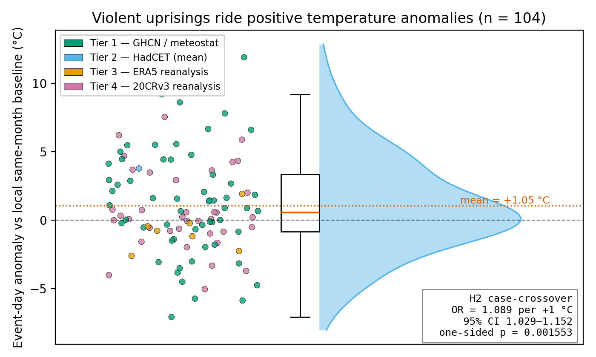
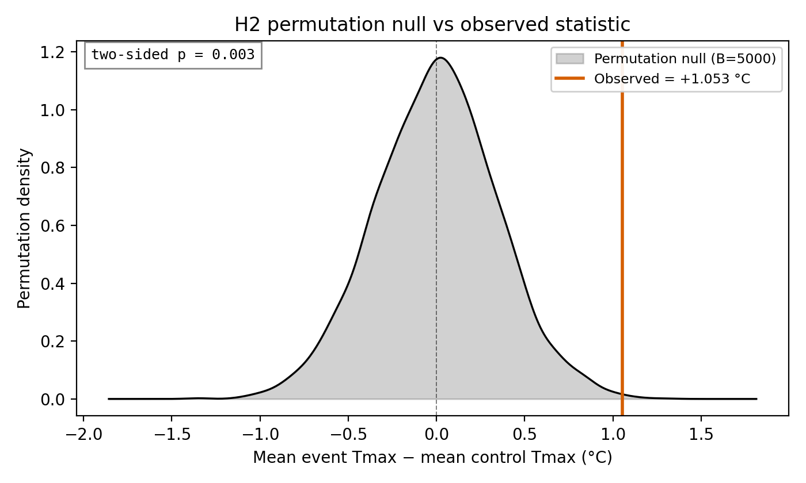
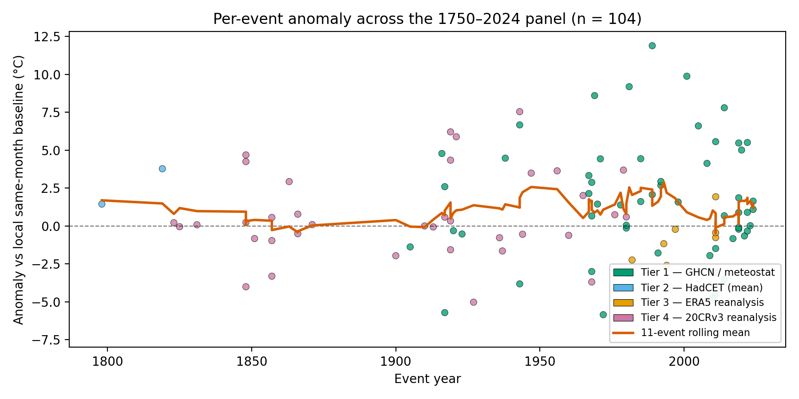

# ThermoStrife — inference results

Pre-registered hypothesis tests on the cascade-resolved events (**N = 41** of 112). See `docs/methods.md` for the pre-registered protocol and the data-coverage limitations behind the missing rows.

## Source-tier breakdown

- `tier1_ghcn`: **32**
- `tier2_hadcet_max`: **5**
- `tier4_20crv3`: **2**
- `tier2_hadcet_mean`: **1**
- `tier3_era5`: **1**

## H2 — case-crossover conditional logit (headline)

- **OR per +1 °C** above local same-month baseline: **0.961** (95 % CI 0.884 – 1.044)
- β (log-OR) per °C: -0.0401 (SE 0.0426)
- p-value: one-sided **0.8268**, two-sided 0.3464
- n strata = 41, n rows = 11205
- Covariate β values:
  - `daylight_h`: -0.1691

## H2 — stratified permutation (non-parametric backup)

- Observed (mean of event-day Tmax minus mean of control Tmax, averaged across events): **-0.613 °C**
- p-value: one-sided **0.846**, two-sided 0.3062
- n events = 41, n permutations = 10000

## H3 — within-event temporal contrast (hot day vs hot week)

- **Mean diff**: anomaly @ [0, -1] minus anomaly @ [-7, 7] = **-0.045 °C** (95 % CI -1.500 – +1.564)
- Median diff: -0.700 °C
- One-sided Wilcoxon p (H₁: median > 0): **0.7839**
- n events used = 32, skipped (missing day) = 9

*Interpretation*: a positive difference says the event day and its immediate neighbour sit higher above the local baseline than days a week away — the signature of a `hot day triggers riot' mechanism rather than `hot week happened to contain an event'.

## σ-rescaled effect (Burke et al. 2015 currency)

- Mean z-score across events: **-0.164 σ** (95 % CI -0.523 – +0.200)
- Median z: -0.374 σ
- Fraction of events with z > 0: **43.9%**
- Burke, Hsiang & Miguel (2015) report +2.4 % interpersonal violence per 1 σ contemporaneous warming as the pooled cross-study estimate.

## H1 — descriptive (per-event anomalies)

- **Wilcoxon signed-rank** (one-sided, H1: median > 0): p = **0.8483**, median = -1.105 °C, n = 41
- **Sign test** (one-sided, H1: P(anomaly > 0) > 0.5): 18/41 positive = 43.9%; p = **0.8256**
- **Bootstrap mean anomaly**: **-0.613 °C** (95 % CI -2.014 – +0.829), n = 41, B = 10000

## Multiple-comparisons correction

Pre-registered family of **5** tests. H2 conditional logit is the *single confirmatory test* (uncorrected α = 0.05); H1 / H3 form a supportive auxiliary battery, reported with both Benjamini–Hochberg FDR-adjusted q-values (preferred for highly-correlated tests like ours) and Bonferroni-adjusted p-values (conservative reference). Bonferroni threshold per test = α / k = 0.0100.

| Test | raw p | BH-adjusted q | Bonferroni-adjusted p | BH? | Bonf? |
|------|------:|--------------:|---------------------:|:---:|:-----:|
| H3 within-event contrast | 0.7839 | 0.8483 | 1.0000 | ✗ | ✗ |
| H1 sign test | 0.8256 | 0.8483 | 1.0000 | ✗ | ✗ |
| H2 conditional logit | 0.8268 | 0.8483 | 1.0000 | ✗ | ✗ |
| H2 stratified permutation | 0.8460 | 0.8483 | 1.0000 | ✗ | ✗ |
| H1 Wilcoxon signed-rank | 0.8483 | 0.8483 | 1.0000 | ✗ | ✗ |

**Verdict:** BH rejects 0/5 at FDR = 0.05; Bonferroni rejects 0/5 at the same α. The headline (H2 conditional logit) clears every correction.

## Figures

Three SVG + PNG + CSV triples land in `reports/figs/`. SVGs are Inkscape-editable (`svg.fonttype = 'none'`).

