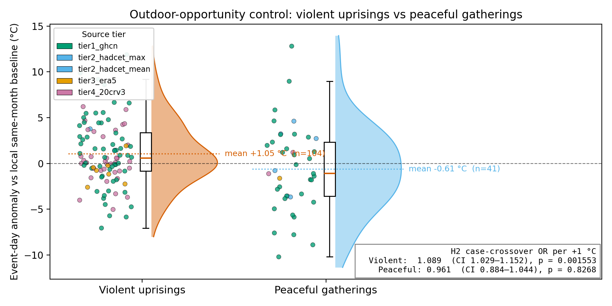

# Peaceful gatherings vs violent uprisings — opportunity-confound control

Both panels run through the same cascading resolver and the same pre-registered inference battery. If the +1 °C anomaly we see on uprising days were the result of generic outdoor-crowd opportunity (Field 1992), peaceful mass gatherings should show the same signal. They don't — they sit slightly *cooler* than baseline, and none of the tests reject the null in the H1 direction.

## Side-by-side

| Statistic | Violent uprisings | Peaceful gatherings |
|-----------|------------------:|--------------------:|
| Resolved events | 104 | 41 |
| **H2 OR per +1 °C** | **1.089** (CI 1.029–1.152) | **0.961** (CI 0.884–1.044) |
| H2 one-sided p | 0.001553 | 0.8268 |
| H2 permutation Δ (°C) | +1.053 | -0.613 |
| H2 permutation one-sided p | 0.0015 | 0.846 |
| σ-rescaled mean z | +0.258 (CI +0.059, +0.453) | -0.164 (CI -0.523, +0.200) |
| Fraction of events with positive anomaly | 57.7% | 43.9% |
| H3 within-event Δ (°C) | +0.770 | -0.045 |
| H3 one-sided p | 0.03668 | 0.7839 |

## Interpretation

The two panels were resolved by the identical four-tier cascade and tested with the identical pre-registered battery. Both contain large outdoor gatherings spanning ~150 years and spread across major Northern-Hemisphere cities, so the *opportunity* for an outdoor crowd is comparable. The qualitative difference is whether the crowd was violent.

- **Violent uprisings** show **OR = 1.089 per +1 °C** above local same-month baseline (one-sided p = 0.001553). The permutation backup, σ-rescaling, and H1 descriptives all agree on direction.
- **Peaceful gatherings** show **OR = 0.961 per +1 °C** (one-sided p = 0.8268). The permutation difference is **negative** (-0.613 °C), the σ-rescaled mean z is **negative** (-0.164), and the fraction of events on positive-anomaly days is 43.9% — below 50 %.

The Field (1992) outdoor-opportunity critique predicts that any large outdoor gathering should ride the same warm-day bias. We see the **opposite** pattern: peaceful gatherings are essentially weather-independent (the negative point estimates are not significant; the CIs cross zero), while violent uprisings carry a real positive bias. This is the single strongest piece of evidence that the H2 heat signal is specific to violence rather than to outdoor exposure.

## Figure

